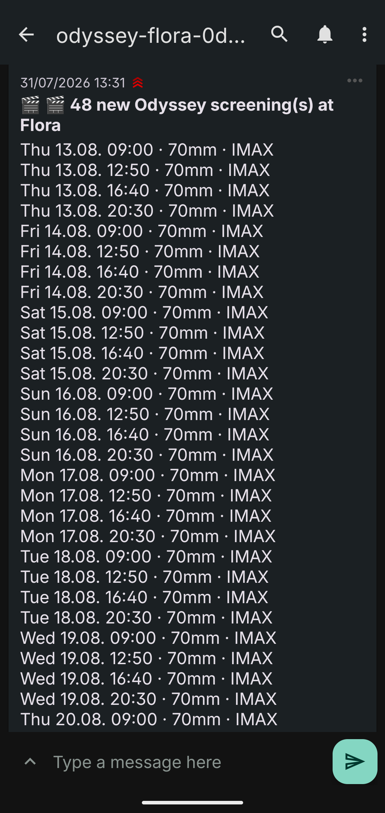
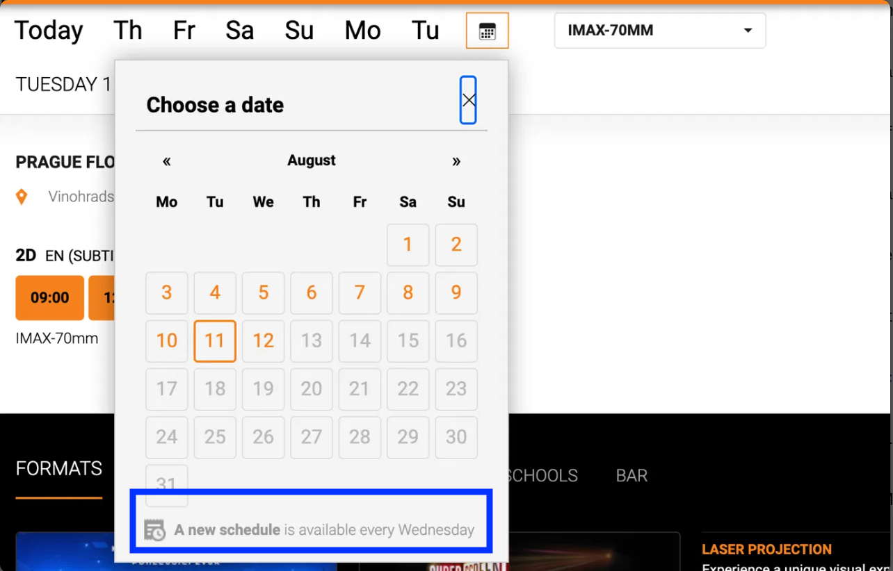
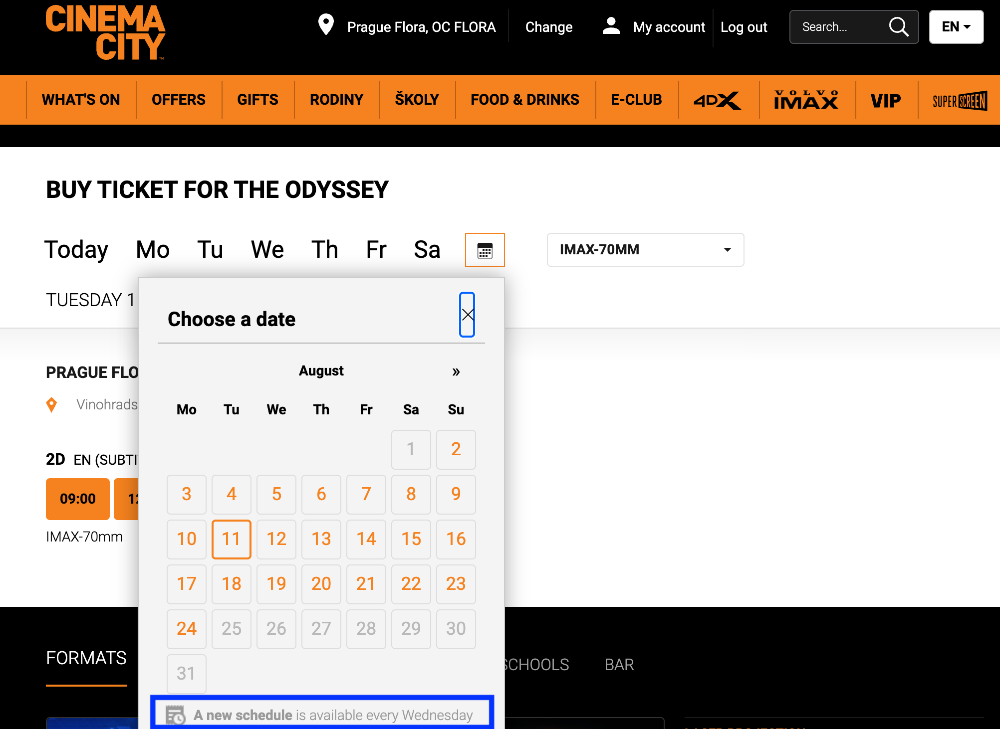

# odyssey-watch

A small Python script that watches a cinema website and texts my phone the
moment new tickets go on sale.

It got me a ticket to see Christopher Nolan's *The Odyssey* in IMAX 70mm.



## Why I built it

Christopher Nolan shot *The Odyssey* on IMAX 70mm film. Very few cinemas in
Europe can actually project that format. Cinema City Flora in Prague is one of
them, so people fly in from other countries to watch it there.

Tickets sell out fast. The cinema adds new dates in batches with no warning and
no way to subscribe for alerts. If you are not on the site soon after a batch
appears, the good seats are gone.

I missed one batch because I forgot to check the website. This is what that
looks like. Everything from 13 August onward is greyed out, because those dates
had not been released yet and I had no way of knowing when they would be:



Note the line at the bottom of that box. The cinema says a new schedule is
available every Wednesday. Hold that thought.

So I stopped checking manually and wrote something to check for me.

## What it does

Every few hours the script:

1. Asks the cinema's website which dates have IMAX 70mm screenings
2. Compares that list against what it saw last time
3. If anything is new, sends a push notification to my phone with a booking link

That is the whole idea. It watches, I book. The script never touches payment or
seat selection, because I want to choose my own seat and I do not want a bot
spending my money while I sleep.

It runs on GitHub Actions, so it keeps working when my laptop is closed.

## Did it work

Yes. On Friday 31 July 2026 at 13:31 my phone buzzed with 48 new screenings.
I booked within minutes.

Here is the same calendar afterwards. The dates that were greyed out are now
open, all the way through 24 August:



## The interesting part

I assumed this would be a simple scheduling problem. Find out when the cinema
publishes new dates, poll hard at that time, done.

Every assumption I made about the timing was wrong.

**The cinema's own website says new schedules appear every Wednesday.** That is
the line I told you to hold onto earlier. The batch that got me my ticket
appeared on a Friday.

**I assumed batches were one week long.** The first change I tracked added
three days. The second added twelve.

**I assumed new listings appear at midnight.** The Friday batch appeared
somewhere between 10:30 and 13:31, so during the working day.

**I assumed a 5 minute schedule on GitHub Actions runs every 5 minutes.** It
does not. GitHub quietly drops frequent scheduled jobs when its runners are
busy. My workflow was actually firing every 2 to 3 hours.

So I had tuned the script to poll aggressively on Tuesday and Wednesday, based
on the cinema's stated schedule, and that tuning did nothing. The alert that
actually worked came from the boring fallback schedule running every few hours
on all the other days.

The lesson I took from this: the clever prediction was worthless and the dumb
reliable polling was what mattered. I now log every observation to CSV instead
of guessing, so the next version is based on what the cinema actually does
rather than what it says it does.

## How it works technically

Cinema City's website loads showtimes from a JSON API in the browser. Nothing
is scraped from HTML, the script just calls the same endpoint the website calls.

Values confirmed by inspecting live responses:

| What | Value |
| --- | --- |
| Cinema (Flora, Prague) | `1052` |
| Film (*The Odyssey*) | `7268s2r` |
| Format tag | `70-mm` |

I guessed all three of these wrong on the first attempt, which is why the script
has a `--probe` mode that prints what the API actually returns before you trust
it.

Screenings are identified by a numeric event ID. New IDs mean new screenings.
The script stores the IDs it has seen in a JSON file and commits that file back
to the repository, so it remembers across runs.

## Running it yourself

```bash
pip install requests
export NTFY_TOPIC=pick-something-random

python3 odyssey_watch.py --probe     # check the API values are right
python3 odyssey_watch.py             # one check
python3 odyssey_watch.py --loop      # keep running
python3 odyssey_watch.py --batches   # group screenings by release batch
```

Notifications go through [ntfy](https://ntfy.sh), which is free and needs no
account. Install the app, subscribe to the same topic name, done. Pick a topic
nobody would guess, because anyone who knows the name can read it.

To point it at a different film or cinema, change `CINEMA_IDS`, `FILM_ID` and
`ATTR_FILTER` at the top of the script. Run `--probe` to find the right values.

## What it does not do

It does not buy tickets. It sends you a link and you do the rest.

That is a deliberate choice. Tickets are non refundable, seat position matters
a lot in an IMAX hall, and an unattended bot would eventually buy me a front row
seat at 9am on a Monday. This is a tool to find out about a screening at the
same time as everyone else refreshing the page, not a tool to buy up inventory.

There is also no sold out flag in the API response, so a screening can already
be gone by the time you tap the notification.

## Data it collects

| File | What is in it |
| --- | --- |
| `seen_events.json` | Screening IDs already notified about |
| `horizon.csv` | How far ahead you could book, at each check |
| `drops.csv` | When new dates appeared, how many, and how far they extended |

`drops.csv` is the useful one. The API has no publish timestamp, so the only way
to learn when the cinema releases dates is to watch and write it down.